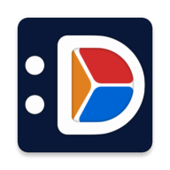

<div align="center">



# Hesapp · DD Budget

**Harcamanı sürükle-bırak ile anında kaydet.**
Ücretsiz kullan, verilerin cihazında kalır, abonelik yok.

[**🌐 Website**](https://sehapps.github.io/dd-budget/) ·
[**▶️ Google Play**](https://play.google.com/store/apps/details?id=com.sehapps.hesapp) ·
[🇹🇷 Türkçe](https://sehapps.github.io/dd-budget/tr/) ·
[🇩🇪 Deutsch](https://sehapps.github.io/dd-budget/de/)

</div>

---

## Uygulama hakkında

Hesapp (global adıyla **DD Budget**), gelir ve giderini zahmetsizce takip etmen için yapılmış bir
Android bütçe uygulaması. Ayırt edici yanı **sürükle-bırak ile işlem ekleme**: kategoriyi hesabının
üzerine sürüklersin, işlem anında kaydedilir. Form doldurmak yok.

### Öne çıkanlar

- **Anında kayıt** — sürükle-bırak ile saniyeler içinde gelir/gider/transfer
- **Ücretsiz kullanılabilir** — ücretsiz sürüm süresiz çalışır, ödemek zorunda değilsin
- **Abonelik yok** — Pro'yu istersen **tek seferlik** açarsın, hiçbir şey yenilenmez
- **Verilerin cihazında** — hiçbir şey otomatik olarak dışarı çıkmaz, uygulama çevrimdışı çalışır
- **Bulut yedekleme isteğe bağlı** — varsayılan kapalı; açarsan yedeğin senin kendi Google Drive'ına gider
- **Grafiklerle analiz** — pasta ve sütun grafikleriyle dönem dönem harcama dağılımı
- **Tekrarlayan işlemler** — abonelikler, faturalar, kira için otomatik kayıt ve hatırlatıcı
- **Bütçe göstergesi** — kategori kutucuğu harcadıkça dolar, bütçeyi aşınca kırmızıya döner
- **Excel (XLSX) dışa aktarma**, etiket + arama, açık/koyu tema, 80+ para birimi

### Sürümler

| | Ücretsiz | Pro *(isteğe bağlı)* |
|---|---|---|
| Ödeme | Yok — süresiz kullanım | **Tek seferlik satın alma** |
| Gelir, gider, transfer | ✅ | ✅ |
| Sürükle-bırak, grafikler, tekrarlayan işlemler | ✅ | ✅ |
| Kategori / hesap sayısı | Sınırlı | Sınırsız |
| Reklam | Var | Yok |
| Google Drive otomatik yedekleme | — | ✅ |
| PIN + biyometrik kilit | — | ✅ |
| Excel (XLSX) dışa aktarma | — | ✅ |

**Abonelik yoktur**, ödeme tek seferliktir ve yenilenmez.

> Sitede bilerek rakam yazmıyoruz: Google Play fiyatı ülkeye göre farklıdır, kurla ve vergiyle değişir.
> Tek doğruluk kaynağı mağazadır — kullanıcı kendi ülkesindeki güncel tutarı orada görür.

---

## Gizlilik

Finansal verilerin **yalnızca cihazında** saklanır; gelir, gider veya bakiye bilgisi sunucularımıza
gönderilmez. Bulut yedekleme tamamen isteğe bağlıdır ve varsayılan olarak kapalıdır — hiç açmadan
uygulamayı sonuna kadar kullanabilirsin. Açtığın takdirde bile yedeğin bizim sunucumuza değil,
**senin kendi Google Drive hesabına** yüklenir.

- [Gizlilik Politikası](https://sehapps.github.io/dd-budget/privacy-tr.html) · [Privacy Policy](https://sehapps.github.io/dd-budget/privacy-en.html)
- [Kullanım Şartları](https://sehapps.github.io/dd-budget/terms-tr.html) · [Terms of Use](https://sehapps.github.io/dd-budget/terms-en.html)

---

## Basın & iletişim

Hesapp / DD Budget hakkında yazmak veya işbirliği yapmak isteyen herkes yazabilir.
Basın kiti (tek cümlelik tanım, künye, iletişim) sitenin **Basın** bölümündedir:
[İngilizce](https://sehapps.github.io/dd-budget/#press) ·
[Türkçe](https://sehapps.github.io/dd-budget/tr/#basin) ·
[Almanca](https://sehapps.github.io/dd-budget/de/#presse)

**İletişim:** [sehappdev@gmail.com](mailto:sehappdev@gmail.com)
**Geliştirici:** Sehapps · **Platform:** Android 8.0+ · **Diller:** Türkçe, İngilizce, Almanca

---

<details>
<summary><b>Bu repo hakkında (teknik notlar)</b></summary>

<br>

Bu repo, GitHub Pages üzerinden yayınlanan halka açık siteyi barındırır: tanıtım sayfası,
gizlilik politikası ve kullanım şartları. Uygulama kaynak kodu bu repoda **değildir**.

### Dosyalar

| Yol | Ne |
|---|---|
| `index.html` | 🇬🇧 Tanıtım sayfası — **sitenin kökü ve varsayılanı** (global dil: İngilizce) |
| `tr/index.html` | 🇹🇷 Tanıtım sayfası → `/tr/` (Hesapp markası) |
| `de/index.html` | 🇩🇪 Tanıtım sayfası → `/de/` |
| `privacy-en.html` / `privacy-tr.html` | Gizlilik politikası |
| `terms-en.html` / `terms-tr.html` | Kullanım şartları |
| `404.html` | Bulunamayan sayfa (kök 404, mutlak yol kullanır) |
| `assets/site.css` | Tanıtım sayfalarının ortak stili |
| `assets/*.webp` | Ekran görüntüleri — sonek yok = TR, `-en` = EN, `-de` = DE |
| `assets/icon.png` | Uygulama ikonu (favicon + logo) |
| `robots.txt` · `sitemap.xml` | Arama motorları (`hreflang` + `x-default` tanımlı) |
| `.nojekyll` | GitHub Pages'in Jekyll işlemesini atlaması için |

Alt klasördeki sayfalar varlıklara `../assets/`, hukuki metinlere `../privacy-*.html` ile bağlanır.

Bağımlılık, derleme adımı ve JavaScript yoktur — düz HTML + tek CSS dosyası.
Yerelde denemek için klasörün içinde basit bir sunucu yeterli:

```
python -m http.server 8777
```

### Yayınlama

Settings → Pages → Deploy from a branch → `main` / `(root)`.
Commit + push sonrası birkaç dakika içinde yayına girer.

### Marka adı ve dil

Mağaza ve arayüz adı dile göre değişir: **Türkçe → Hesapp**, diğer tüm dillerde → **DD Budget**.
Global dil **İngilizce**'dir; kök adres İngilizce sayfayı açar, diğer diller alt klasörde durur.
Yeni bir dil eklerken aynı deseni izle: `xx/index.html` + `../assets/` yolları + üç sayfanın
dil bağlantılarına ve `sitemap.xml`'e yeni dili ekle.

### Fiyat yazmama kuralı

Sayfalarda **rakamla fiyat yazılmaz.** Google Play fiyatı ülkeye göre farklıdır, kurla ve
vergiyle değişir; statik sayfadaki bir rakam sessizce eskir ve kullanıcının mağazada göreceğinden
farklı çıkabilir. Bunun yerine yapının kendisi anlatılır — "tek seferlik satın alma, abonelik yok" —
ve kesin tutar için mağazaya yönlendirilir.

### app-ads.txt bu repoda DEĞİL

Reklam envanteri için gereken `app-ads.txt`, IAB standardı gereği **alan adının kökünde**
sunulmak zorundadır. Bu site `sehapps.github.io/dd-budget/` alt klasöründe olduğundan dosyayı
buraya koymak işe yaramaz — AdMob alt klasöre bakmaz, şu adresi tarar:

```
https://sehapps.github.io/app-ads.txt
```

Bu yüzden dosya ayrı bir repoda duruyor: **`sehapps/sehapps.github.io`**.
Buraya bir `app-ads.txt` ekleme — çalışmaz ve yanlış güven verir.

> İleride özel alan adı alınıp bu repoya bağlanırsa, o zaman alan adının kökü burası olur ve
> `app-ads.txt` buraya taşınmalıdır.

### ⚠️ Hukuki metinlerin ikinci kopyası

Bu repodan önce hukuki sayfalar `DD-Budget-Legal` reposunda yayınlanıyordu ve **o adres
uygulama binary'sine gömülü** (`core/legal/LegalLinks.kt`), ayrıca Play Console ve AdMob'a girili.
Kullanıcıların telefonundaki mevcut sürümler hâlâ oraya gidiyor, bu yüzden o repo yayında bırakıldı.

**Sonuç: gizlilik politikası ve kullanım şartları şu an iki yerde duruyor.**
Metni güncellerken **her iki repoyu da** güncelle. Bu ikilik, uygulamanın bir sonraki sürümünde
`LegalLinks.kt` + Play Console + AdMob bu repoya çevrilince ortadan kalkar.

### Yapılacak

- [ ] Play butonunda Google'ın resmî "Google Play'den indir" rozet görseli (şu an markasız CSS butonu)
- [ ] 🇩🇪 Almanca hukuki metinler (`privacy-de.html` / `terms-de.html`) — şu an DE sayfası İngilizce sürümlere bağlanıyor
- [ ] 🇹🇷 `/tr/` için ayrı ekran görüntüsü seti zaten var; DE hukuki metinler gelince `de/` de tam olur
- [ ] `LegalLinks.kt` + Play Console + AdMob URL'lerini bu repoya çevir, sonra eski repoyu yönlendirmeye dönüştür

</details>

---

<div align="center">
<sub>© 2026 Sehapps · Google Play ve Google Play logosu Google LLC'nin ticari markalarıdır.</sub>
</div>
